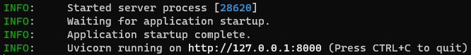
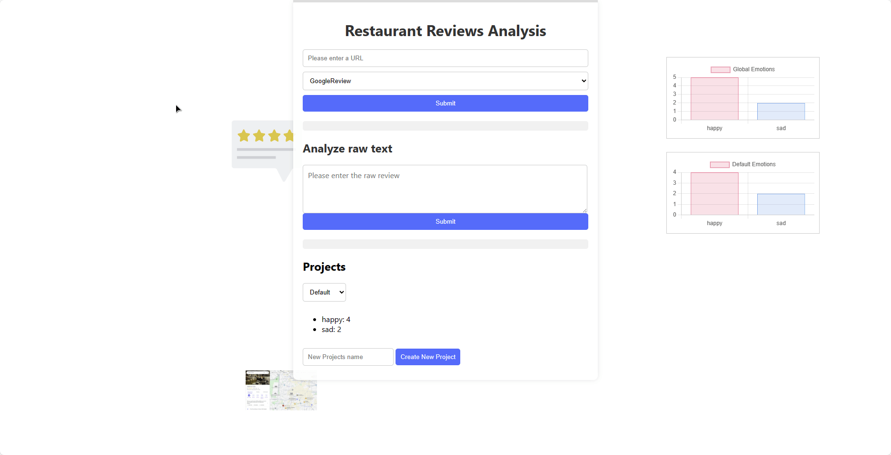
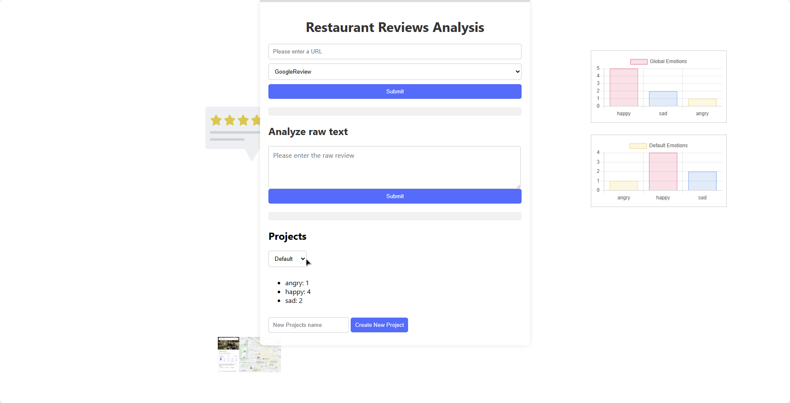

# Aplicación Web de Análisis de Sentimientos

Esta aplicación utiliza diversas bibliotecas de Python para analizar sentimientos de reseñas de texto y extraer datos de raspado web de sitios populares de reseñas como Google Reviews, TripAdvisor y Yelp.

Los textos deben proporcionarse en inglés para mantener la precisión en el análisis tanto de sentimientos como de emociones. La aplicación hace uso de herramientas de Procesamiento del Lenguaje Natural (NLP) para determinar si un texto tiene un sentimiento positivo, negativo o neutro en el contexto de las reseñas de restaurantes. Además, analiza la emoción subyacente en el texto, identificando posibles estados emocionales como felicidad ("happy"), tristeza ("sad") o enfado ("angry").

La aplicación web permite al usuario ingresar un texto en bruto para su análisis o introducir la URL de un restaurante específico. También incluye un apartado de proyectos, donde se almacenan los resultados obtenidos del análisis de emociones. Esto permite al usuario cambiar entre proyectos y observar las emociones predominantes en cada uno. Además, proporciona un recuento global de las emociones capturadas en todos los proyectos.

Con esta aplicación, los usuarios pueden comprender mejor el sentimiento y la emoción detrás de las reseñas de los restaurantes, lo que les permite tomar decisiones informadas sobre dónde comer o qué lugares visitar.

## Requisitos Previos

Antes de ejecutar la aplicación, asegúrese de tener instaladas las siguientes dependencias:

- **FastAPI**: La principal biblioteca para construir APIs web con Python. Instálese usando `pip install fastapi uvicorn`.
- **Playwright**: Utilizado para automatización del navegador. Instálese usando `pip install playwright`.
- **BeautifulSoup4**: Utilizado para análisis de HTML. Instálese usando `pip install beautifulsoup4`.
- **Transformers**: Proporciona acceso a modelos preentrenados de NLP. Instálese usando `pip install transformers`.
- **Pydantic**: Una biblioteca para validación de datos en Python. Instálese usando `pip install pydantic`.

Para instalar las dependencias de Python de manera sencilla, utilice el archivo facilitado `requirements.txt`:

```bash
pip install -r requirements.txt
```
## Despliegue en servidor Pub Int


## Despliegue en local

Asegurese de tener la siguiente estructura de documentos.

```
Sentiment_Analysis_Web_App
    ├── server
    └── user_interface
```

Sigue los siguientes pasos para ejecutar la aplicación:

1. Acceda a la terminal del servidor donde planea alojar la herramienta (en este caso, una terminal de nuestra máquina). Navegue hasta el directorio `server` y ejecute el siguiente comando para iniciar el servidor. En este caso, se utiliza FastAPI como backend.
   ```bash
   uvicorn sentimentAnalysisApp:app
   ```
   Observese que se tiene como respuesta algo similar a:
   
  
3. Seguidamente, en otra terminal de su servidor, ejecute el frontend. Utilice la herramienta que estime oportuna, para este caso, se hará uso de Liver Server. Instalese la extensión y sobre el archivo `index.html` seleccione la opción "open with Live Server" Asegúrese de mantener la estructura de carpetas tal como se presenta en este repositorio; de lo contrario, el sistema podría experimentar fallos. Otra posible forma de acceder al frontend sería navegando a la ruta de los documentos estáticos de fastAPI, siendo `http://127.0.0.1:8000/static/index.html` en este caso.

4. Una vez que tanto el servidor como el cliente estén en funcionamiento, navege a las URL proporcionadas por la terminal, típicamente `http://127.0.0.1:8000/` para FastAPI y `http://127.0.0.1:5500/` para Live Server.

## Uso

Análisis de un texto en bruto:


Cambio y creación de projectos:


## Copmentarios

Si quiere revisar el servidor en local, para acceder a FastAPI se debe incluir en la URL /docs es decir `http://127.0.0.1:8000/docs`.
Mencionar también que la opción de analizar reseñas de TripAdvisor esta desabilitada y se desaconseja su uso.


